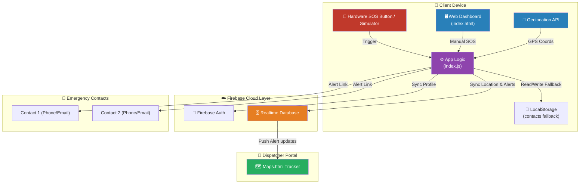
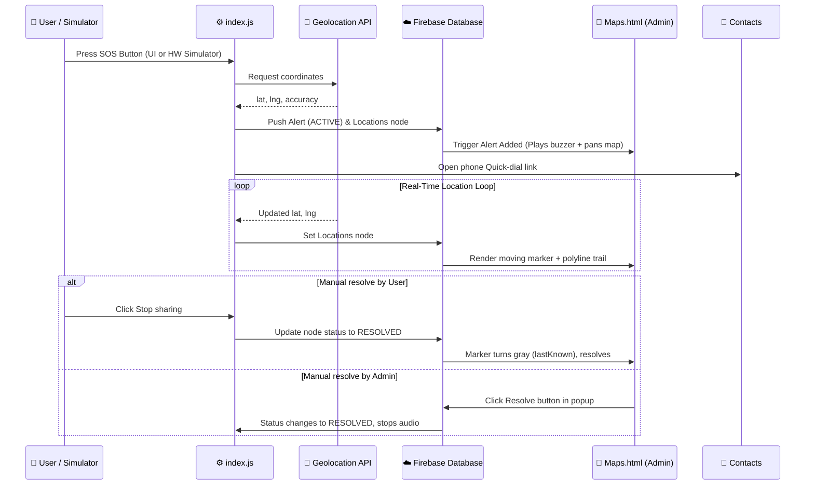
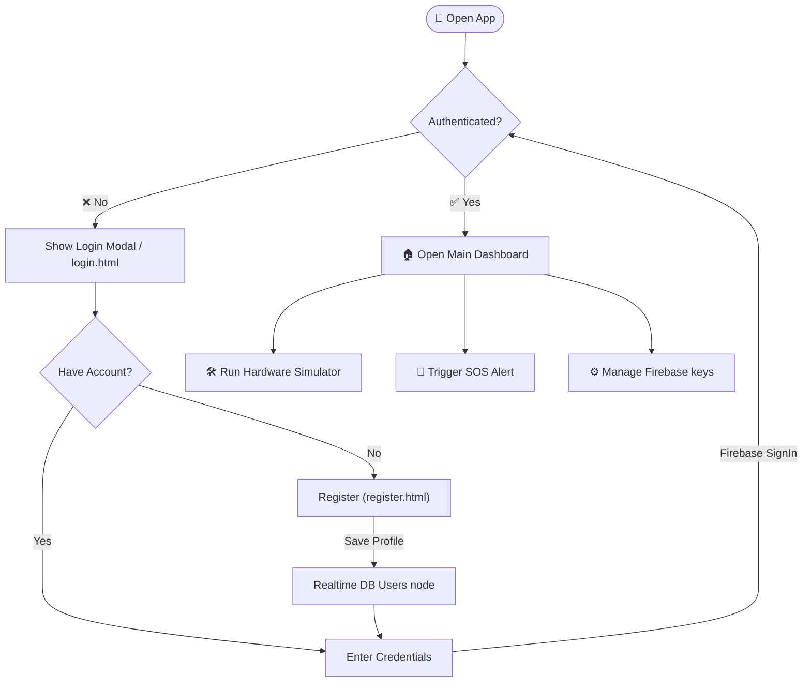
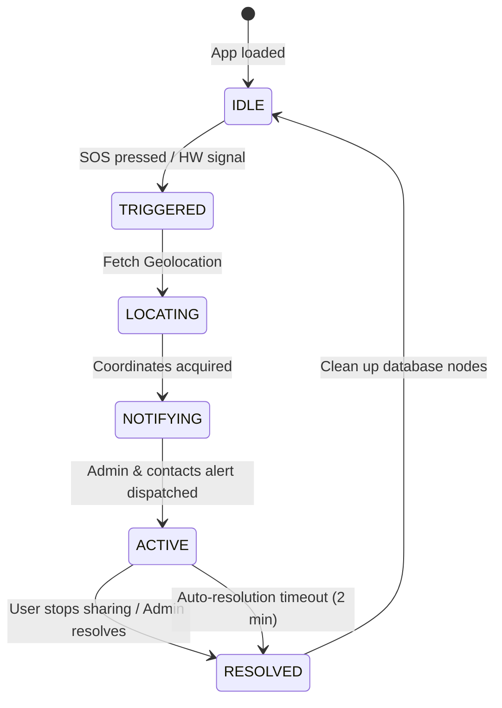

# SafeGuard — Women Safety Alert System

<div align="center">

🛡️ **Empowering women with technology for safety and peace of mind.**


</div>

---

**SafeGuard** is a comprehensive women safety application providing immediate emergency response and real-time location tracking. It combines hardware device integration with a web-based dashboard for live monitoring and alert management.

---

## 🚨 Features

### Core Safety & Live Tracking
- **Emergency SOS Button** — One-touch emergency alert trigger.
- **Real-Time GPS Tracking** — Automatic location detection and sharing.
- **Location Mapping** — Visual representation of incident locations with pulsing markers.
- **Coordinate Breadcrumbs Trail** — Traces and draws a dashed polyline of the victim's route history on the map while an SOS is active.
- **Synthesized Web Audio Siren** — Generates a warning alarm tone completely client-side using the HTML5 Web Audio API (no external audio assets required).

### IoT Hardware Device Simulation
- **Visual Telemetry Controls** — Side dashboard panel allowing users to test wearable device inputs without real hardware:
  - ESP32 hardware connection status toggling.
  - Custom battery status slider (with automated low battery alerts).
  - Walk/Run GPS movement simulator (auto-updates coordinates on map).
  - Physical SOS button trigger simulation.

### User & Contacts Management
- **Secure Authentication** — Unified Firebase Auth login and registration system.
- **Device Integration** — Hardware device connectivity status indicators.
- **Emergency Contact Panel** — Cloud syncing of contacts via Firebase Realtime Database with secure browser-based `localStorage` fallback for offline resiliency.

### Alert Management & Admin Controls
- **Responder Map Portal (Maps.html)** — A full-screen administrative tracking map designed for dispatch centers with administrative sound notification warnings.
- **Manual Alert Resolution** — Admins/Responders can mark an active alert as resolved directly from the Leaflet marker details popup, syncing safety updates back to Firebase.
- **Auto-Resolution** — Configurable alert timeout (default 2 minutes) if no response is detected.

---

## 🛠️ Tech Stack

| Layer | Technology |
|-------|------------|
| Frontend | HTML5, CSS3, JavaScript (ES6+) |
| Styling | Custom CSS, Dark Glassmorphism, Responsive Grid |
| Location | Browser Geolocation API, Leaflet.js Mapping |
| Database | Firebase Realtime Database (Location & Alert syncing) |
| Auth | Firebase Authentication |
| Sound | HTML5 Web Audio API Synthesizer |
| Storage | Browser LocalStorage (fallback & configurations) |

---

## 📁 Project Structure

```
SafeGuard-main/
├── index.html        # Main dashboard interface
├── index.js          # Main application logic & Leaflet setup
├── styles.css        # Glassmorphic dark-theme styles
├── login.html        # Standalone login fallback page
├── register.html     # Signup page with database registry hooks
├── Maps.html         # Responder tracking portal
├── config.js         # Firebase credentials loader
├── FIREBASE_RULES.md # Database rules setup reference
├── FIREBASE_SETUP.md # Web project configuration reference
└── README.md         # Unified project documentation
```

---

## 🚀 Getting Started (Local Run)

### 1. Prerequisites
- Modern web browser with JavaScript enabled.
- A local HTTP server is required to serve the files over HTTP and bypass browser module/storage restrictions.

### 2. Start a Local Server
Run one of the following commands in the project directory:

**Using Python:**
```bash
python -m http.server 8000
```

**Using Node.js (http-server):**
```bash
npx http-server -p 8000
```

### 3. Open the Portals
Open your browser and navigate to:
- **Dashboard & Simulator**: [http://localhost:8000/index.html](http://localhost:8000/index.html)
- **Admin Tracker**: [http://localhost:8000/Maps.html](http://localhost:8000/Maps.html)

---

## 🔧 Firebase Configuration Setup

SafeGuard is configured to work out-of-the-box using fallback demo credentials, but for production or standalone deployments, follow these steps to connect your own database:

1. Create a project at the [Firebase Console](https://console.firebase.google.com/).
2. Add a Web App to your project and copy the configuration keys.
3. In the SafeGuard Dashboard, click **Configure Firebase Cloud** inside the **Device Settings** card.
4. Input your project credentials (API Key, Project ID, Database URL) and click **Save & Refresh**.
5. Enable **Email/Password Provider** inside Firebase Auth.
6. Enable **Realtime Database** and set the security rules to allow read/write access (refer to [FIREBASE_RULES.md](file:///d:/SafeGuard-main/FIREBASE_RULES.md)).

---

## 📊 Architecture & Diagrams

### 1. 🏗️ System Architecture



---

### 2. 🔄 SOS Alert Flow (Sequence)



---

### 3. 👤 User Authentication Flow



---

### 4. 📍 Alert Lifecycle (State Machine)



---

## 🔒 Privacy & Security

- Location data is processed **locally** and synced to Firebase only when an active SOS alert is running.
- Custom configurations and database project keys are stored securely inside the client's **browser local storage**.
- All database communication is encrypted in transit by Firebase SSL.

---

## 🤝 Contributing

Contributions to improve women's safety technology are welcome!
1. Fork the project.
2. Create your feature branch (`git checkout -b feature/AmazingFeature`).
3. Commit your changes (`git commit -m 'Add AmazingFeature'`).
4. Push to the branch (`git push origin feature/AmazingFeature`).
5. Open a Pull Request.

---

## 📄 License

Distributed under the MIT License. See `LICENSE` for more information.
