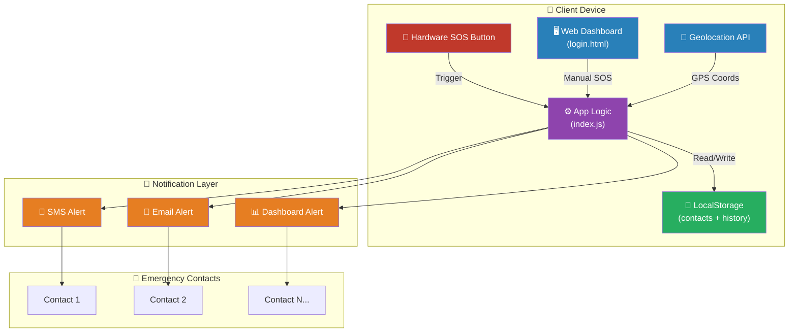
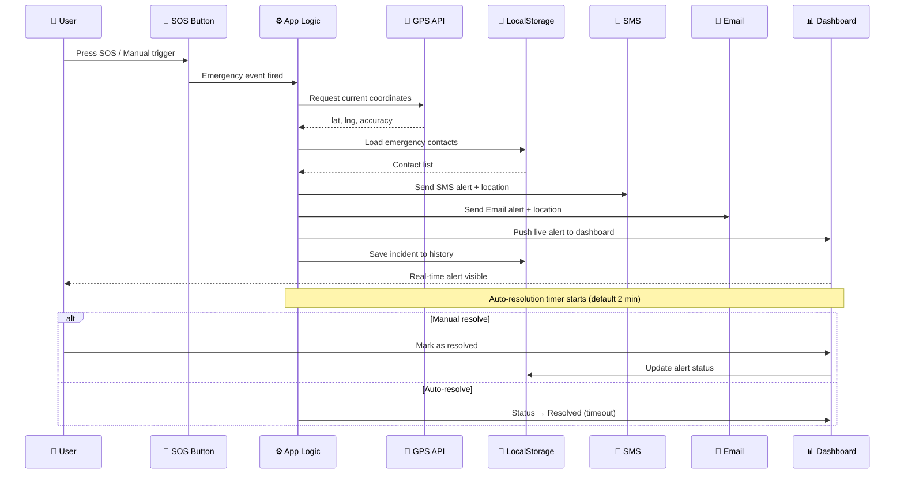
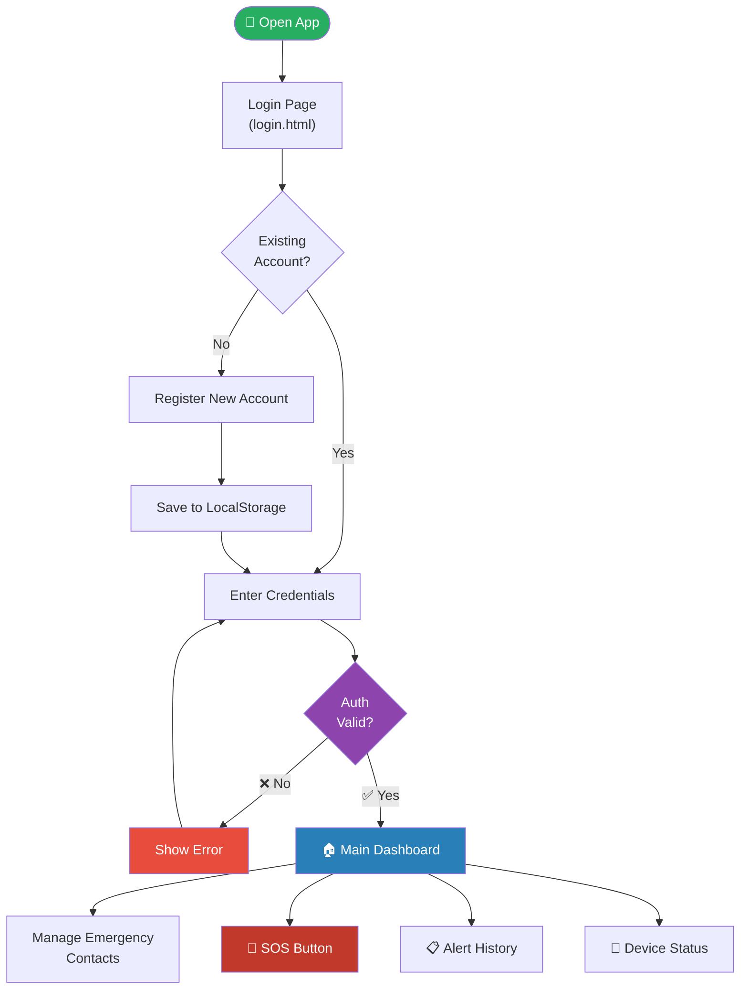
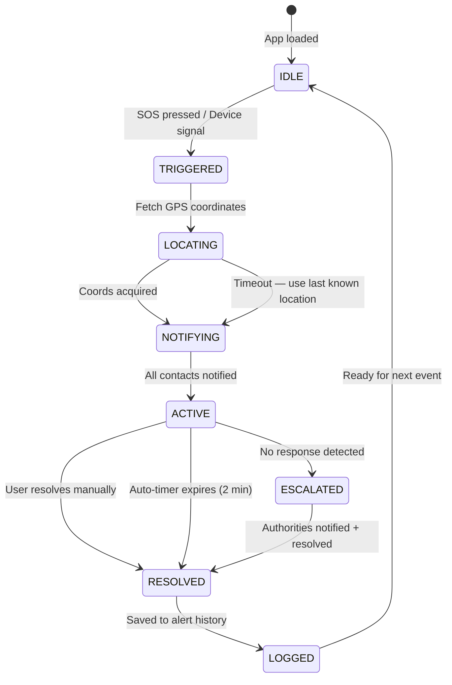
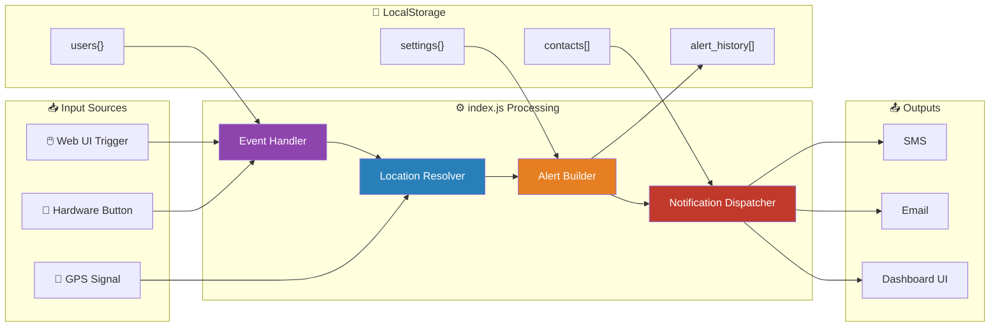
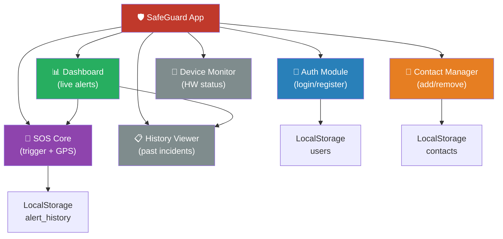

# SafeGuard — Women Safety Alert System

<div align="center">

🛡️ **Empowering women with technology for safety and peace of mind.**


</div>

---

**SafeGuard** is a comprehensive women safety application providing immediate emergency response and real-time location tracking. It combines hardware device integration with a web-based dashboard for live monitoring and alert management.

---

## 🚨 Features

### Core Safety
- **Emergency SOS Button** — One-touch emergency alert trigger
- **Real-Time GPS Tracking** — Automatic location detection and sharing
- **Emergency Contact Notifications** — Instant SMS/Email alerts to predefined contacts
- **Live Alert Dashboard** — Real-time monitoring of active alerts
- **Location Mapping** — Visual representation of incident locations

### User Management
- **Secure Authentication** — Login and registration system
- **Device Integration** — Hardware device connectivity status
- **Emergency Contact Management** — Add and manage trusted contacts

### Alert Management
- **Alert History** — Full log of past emergency incidents
- **Status Monitoring** — Active, resolved, and pending alert states
- **Automatic Resolution** — Configurable auto-resolution timers

---

## 🛠️ Tech Stack

| Layer | Technology |
|-------|------------|
| Frontend | HTML5, CSS3, JavaScript (ES6+) |
| Styling | Custom CSS, Responsive Design |
| Location | Browser Geolocation API |
| Real-time | JavaScript Event-Driven Architecture |
| Storage | Browser LocalStorage |
| Notifications | SMS + Email (multi-channel) |

---

## 📁 Project Structure

```
women-safety/
├── index.js          # Main application logic and functions
├── login.html        # Main HTML interface
├── styles.css        # Application styling
└── README.md         # Project documentation
```

---

## 🚀 Getting Started

### Prerequisites
- Modern web browser with JavaScript enabled
- Internet connection for geolocation services
- Hardware safety device *(optional, for full functionality)*

### Installation

```bash
# Clone the repository
git clone https://github.com/your-username/women-safety.git
cd women-safety

# Open in browser
open login.html
# No build steps — fully client-side
```

### Usage

1. **Register / Login** — Create an account or log in
2. **Add Emergency Contacts** — Configure who receives alerts
3. **Activate SOS** — Press emergency button when in danger
4. **Monitor Alerts** — View live alerts on the dashboard

---

## 🔧 Configuration

### Emergency Contacts
- Add multiple emergency contacts
- Supports SMS and email notifications
- Stored securely in browser LocalStorage

### Alert Settings
- Auto-resolution timer *(default: 2 minutes)*
- Location accuracy preferences
- Notification channel preferences

---

## 📊 Architecture & Diagrams

---

### 1. 🏗️ System Architecture



---

### 2. 🔄 SOS Alert Flow (Sequence)



---

### 3. 👤 User Authentication Flow



---

### 4. 📍 Alert Lifecycle (State Machine)



---

### 5. 🗂️ Data Flow & Storage



---

### 6. 📱 Component Structure



---

## 📱 How It Works

1. **Detection** — Hardware device or manual UI trigger fires the SOS event
2. **Location** — GPS coordinates captured automatically via Geolocation API
3. **Notification** — Emergency contacts receive instant SMS + email with location
4. **Tracking** — Location pinned on the live dashboard in real time
5. **Response** — Alert resolved manually or auto-expires after 2 minutes
6. **Logging** — Full incident saved to history for future reference

---

## 🔒 Privacy & Security

- Location data processed **locally** wherever possible
- Emergency contacts stored in **encrypted browser storage**
- **No personal data** transmitted without explicit user consent
- All outbound communications are **encrypted in transit**
- Zero third-party analytics or tracking

---

## 🤝 Contributing

Contributions to improve women's safety technology are welcome!

```bash
# Fork → branch → commit → push → PR
git checkout -b feature/YourFeature
git commit -m 'Add YourFeature'
git push origin feature/YourFeature
# Open a Pull Request
```

**Guidelines:**
- Do not reduce alert sensitivity or response speed
- Test all SOS flows before submitting PR
- Include screenshots or screen recordings as proof
- Keep location accuracy logic intact

---

## 🙋‍♀️ Support

- Open an issue on GitHub
- Contact the development team
- Check documentation for common solutions

---

## 📄 License

MIT License — see [LICENSE](LICENSE) for details.

---

<div align="center">

**SafeGuard** — Empowering women with technology for safety and peace of mind. 🛡️✨

</div>
